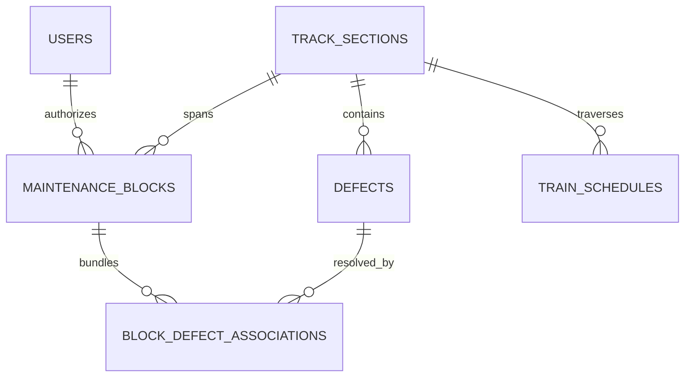

# Samanvay-AI: Central Backend & AI Optimization Engine
**Problem ID:** SIH-26027  
**Title:** AI-Powered Automatic Block Planning to Maximize Asset Availability for Train Operations on Indian Railways  
**Division:** North Central Railway (NCR) • Prayagraj Division (GZB-TDL-CNB 440 Km Trunk Corridor)

---

## 1. Overview
The **Samanvay-AI** backend is the central operational brain connecting the React Control Room Dashboard and the Field Engineer Mobile App (`IronSentinel`). It unifies maintenance backlogs from legacy Indian Railways systems:
- **TMS** (Track Management System - Civil / Engineering)
- **SMMS** (Signal Maintenance Management System - S&T)
- **TDMS** (Traction Distribution Management System - Electrical / OHE)
- **COA** (Control Office Application - Passenger & Freight Timetable Schedules)

It uses **Google OR-Tools (CP-SAT constraint programming)** to bundle multi-department maintenance requests into optimal timetable gaps, minimizing train delays and preventing block bursts.

---

## 2. Directory Structure

```text
backend/
├── app/
│   ├── main.py                     # FastAPI application entrypoint & CORS
│   ├── core/
│   │   ├── config.py               # Pydantic Settings & environment config
│   │   ├── database.py             # SQLAlchemy engine & session factory
│   │   └── key_rotator.py          # Round-Robin API key rotator & failover engine
│   ├── models/
│   │   ├── user.py                 # Section Controller & Field Engineer accounts
│   │   ├── track_section.py        # Indian Railways corridor segments & lines
│   │   ├── defect.py               # TMS, SMMS, TDMS defects & criticality
│   │   ├── timetable.py            # COA train paths, priorities & transit slots
│   │   └── block.py                # Maintenance blocks, bundles & Dual-Key PTW
│   ├── schemas/
│   │   ├── common.py               # Enums (Department, Severity, BlockStatus)
│   │   ├── defect.py               # Defect request/response validation
│   │   ├── block.py                # Block creation, approval, execution schemas
│   │   ├── timetable.py            # Timetable and traffic gap models
│   │   └── sync.py                 # Offline mobile downstream/upstream contracts
│   ├── api/
│   │   └── v1/
│   │       ├── api_router.py       # Consolidated API router
│   │       ├── defects.py          # Defect CRUD & NLP triage endpoints
│   │       ├── blocks.py           # Block planning & OR-Tools CP-SAT generator
│   │       ├── conflicts.py        # Continuous spatial-temporal collision detection
│   │       ├── live_ws.py          # Real-time WebSocket train telemetry stream
│   │       ├── timetable.py        # Timetable gap analysis
│   │       └── sync.py             # Mobile delta sync (downstream & upstream)
│   └── services/
│       ├── block_optimizer.py      # Google OR-Tools CP-SAT timetable bundler
│       ├── defect_scorer.py        # ML Criticality Scoring Engine (0-100)
│       ├── gemini_service.py       # Autonomous Multilingual NLP Defect Parser
│       ├── graph_network.py        # NetworkX Directed Multigraph Corridor Topology
│       ├── safety_lease_service.py # HMAC-SHA256 Offline Field Lease Token Engine
│       └── weather_service.py      # OpenWeather corridor telemetry & CWR rail temperature
├── data/
│   └── seed_data.py                # Synthetic seeder (Prayagraj/NCR Golden Corridor)
├── tests/
│   ├── conftest.py                 # Pytest session fixtures
│   ├── test_api.py                 # Endpoints & optimization test suite
│   ├── test_live.py                # Live telemetry & WebSocket tests
│   ├── test_operational_hardening.py # Dual-key handshake, emergency revocation tests
│   ├── test_roundrobin_keys.py    # Multi-key rotation & failover tests
│   └── test_sync.py                # Mobile synchronization test suite
├── .env.example
├── requirements.txt
└── Dockerfile
```

---

## 3. Database Storage & Relational Models

Data is managed using **SQLAlchemy 2.0 ORM** connected to SQLite (`samanvay.db`) in local development or PostgreSQL in cloud deployments.



- **`track_sections`**: Corridor segment bounds, speed limits (130/160 km/h), electrification specs.
- **`maintenance_blocks`**: Shadow block bundles, G&SR 4.14 Dual-Key Handshake tokens (`controller_private_number`, `station_master_private_number`), HMAC offline lease tokens (`safety_lease_token`), and assigned heavy machinery.
- **`defects`**: Multi-department defect backlogs (TMS, SMMS, TDMS) with severity rank, speed restrictions (TSR), GPS coordinates, and ML risk scores.
- **`block_defect_associations`**: Many-to-many junction mapping which block possession resolves which backlog defects.
- **`train_schedules`**: COA train paths (Rajdhani, Vande Bharat, Freight) with priority ranks and timetable slots.
- **`users`**: Role-based access control for Section Controllers, Dispatchers, and Field Crews.

---

## 4. Quickstart Guide

### Step 1: Install Dependencies
```bash
pip install -r requirements.txt
```

### Step 2: Seed the Database with Indian Railways Corridor Data
Populates the Prayagraj Division (NCR) Ghaziabad-Tundla-Kanpur high-density corridor, Vande Bharat/Rajdhani/Freight timetables, and multi-department defects:
```bash
python data/seed_data.py
```

### Step 3: Run the FastAPI Server
```bash
uvicorn app.main:app --reload --port 8000
```
- Interactive OpenAPI Docs: `http://localhost:8000/docs`
- Alternative ReDoc: `http://localhost:8000/redoc`
- Health check: `http://localhost:8000/health`

### Step 4: Run Automated Tests
```bash
# Run endpoint verification suite
python test_api_endpoints.py

# Run full pytest suite
pytest -v
```

---

## 5. Key Endpoints & API Highlights

### A. Dual-Key Safety Handshake & G&SR Workflows
- **Controller Approval (`PUT /api/v1/blocks/{id}/controller-approve`)**:
  Generates and logs Section Controller Private Number (PN) and sets caution orders.
- **Station Master Concurrence (`PUT /api/v1/blocks/{id}/station-master-concur`)**:
  Issues Station Master PN and mints an offline HMAC-SHA256 safety lease token for field crews.
- **Emergency Revocation (`PUT /api/v1/blocks/{id}/emergency-revoke`)**:
  Unilaterally cancels block in emergency scenarios (e.g. disaster relief express passage).

### B. Autonomous NLP Multilingual Defect Parser (`POST /api/v1/defects/ai-parse`)
- Ingests noisy voice notes or transcripts in Hindi, English, or Hinglish.
- Structures them into validated railway defect schemas with automatic multi-key round-robin rotation.

### C. Google OR-Tools Constraint Optimizer (`POST /api/v1/blocks/optimize/generate`)
- Scans train transit schedules across the corridor line.
- Identifies natural traffic gaps (e.g., 105–135 minute intervals between express trains).
- Clusters cross-department defects (Track + Signal + OHE) within spatial threshold (e.g. 8 km).
- Maximizes total criticality score resolved while guaranteeing no block burst or timetable collision.
